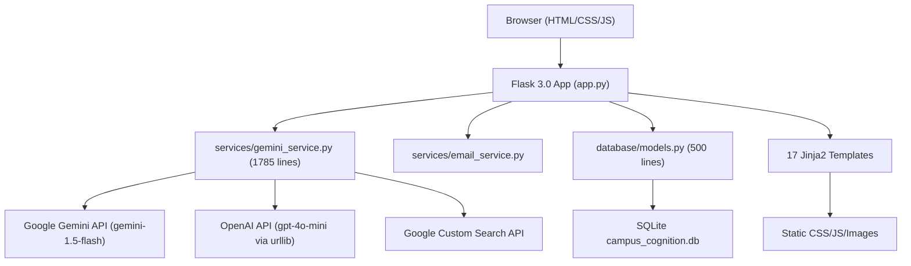

# Campus Cognition V2 — Complete Codebase Audit

**Date**: 2026-08-11
**Auditor**: AI Engineering Audit
**Scope**: Full repository inspection — backend, frontend, AI, database, search, security, deployment

---

## 1. Existing Architecture



### Key Architecture Observations

- **Monolithic file**: `gemini_service.py` is 1785 lines containing ALL AI logic, ALL search logic, ALL prompts, ALL fallback data, and ALL hardcoded opportunity catalogs.
- **No service separation**: AI providers, search, document processing, and opportunity data are all intermixed.
- **No repository pattern**: `models.py` contains raw SQLite queries mixed with business logic.
- **Two app entry points**: `app.py` (985 lines, primary) and `app_new.py` (623 lines, appears to be an older/alternate version with destructive signup logic).
- **No caching layer**: Every search/AI call hits external APIs synchronously.
- **Synchronous document processing**: PDF upload → extract → send to AI → wait → return. No async pipeline.

---

## 2. Existing Endpoints

### Authentication
| Method | Route | Status |
|--------|-------|--------|
| GET/POST | `/login` | ✅ Working |
| GET/POST | `/signup` | ✅ Working |
| GET/POST | `/forgot-password` | ✅ Working |
| GET/POST | `/reset-password/<token>` | ✅ Working |
| GET | `/logout` | ✅ Working |

### Core Application
| Method | Route | Status |
|--------|-------|--------|
| GET | `/dashboard` | ✅ Working |
| GET/POST | `/study` | ✅ Working (slow) |
| GET/POST | `/code-assistant` | ✅ Working |
| GET/POST | `/opportunities` | ⚠️ Partially working |
| GET | `/scholarships` | ✅ Working |
| GET | `/internships` | ✅ Working |
| GET/POST | `/profile` | ✅ Working |
| POST | `/change-password` | ✅ Working |
| GET | `/activity` | ✅ Working |

### API Endpoints
| Method | Route | Status |
|--------|-------|--------|
| POST | `/analyze-study-material` | ⚠️ Duplicate of `/study` POST |
| POST | `/analyze-code` | ⚠️ Duplicate of `/code-assistant` POST |
| POST | `/api/explore-scholarships` | ⚠️ Depends on API keys / CSE config |
| POST | `/api/explore-internships` | ⚠️ Depends on API keys / CSE config |
| POST | `/api/analyze-scholarship` | ✅ Working |
| POST | `/api/analyze-internship` | ✅ Working |
| POST | `/api/get-recommendations` | ✅ Working |
| GET | `/api/ai-status` | ⚠️ Leaks partial API key |
| GET | `/study/<session_id>` | ✅ Working |
| GET | `/code-assistant/<analysis_id>` | ✅ Working |

---

## 3. Existing Database Usage

### Engine
- **SQLite 3** via Python `sqlite3` module
- Database file: `database/campus_cognition.db` (53 KB)
- Vercel fallback: copies DB to `/tmp` on cold start

### Tables
| Table | Columns | Purpose |
|-------|---------|---------|
| `users` | id, username, email, password, first_name, last_name, branch, cgpa, created_at, updated_at | User accounts |
| `study_sessions` | id, user_id, title, syllabus_path, pqp_path, important_topics, study_priority, weekly_plan, charts_data, created_at | Study analysis results |
| `opportunities` | id, title, company, description, required_skills, required_branch, min_cgpa, deadline, link, type, created_at | Opportunity catalog |
| `user_opportunities` | id, user_id, opportunity_id, match_percentage, applied, applied_at | User-opportunity mapping |
| `code_analysis` | id, user_id, code, language, explanation, errors, suggestions, optimized_code, created_at | Code review history |
| `activity_log` | id, user_id, action, description, created_at | Audit trail |
| `password_reset_tokens` | id, user_id, token_hash, expires_at, used_at, created_at | Reset tokens |

### Data Status
- The `.db` file exists (53 KB) and contains seed opportunity data plus any user data from testing.
- Sample opportunities are inserted on every startup if the table is empty.

---

## 4. Existing AI Providers

### Google Gemini
- **SDK**: `google-generativeai` v0.3.0
- **Model**: `gemini-1.5-flash`
- **Used for**: Study analysis, code review, opportunity matching, scholarship analysis, internship analysis, live scholarship/internship discovery
- **Status**: ⚠️ API key is placeholder `YOUR_API_KEY_HERE` in `.env`

### OpenAI
- **No SDK dependency**: Uses raw `urllib.request` to call `/v1/chat/completions`
- **Model**: `gpt-4o-mini` (hardcoded)
- **Status**: ⚠️ API key exposed in `.env` file (CRITICAL security issue — key must be rotated)
- **Timeout**: 22 seconds per call

### Fallback Chain
```
User preferred engine → Alternative engine → Local heuristic fallback
```
- Local fallback is extensive: subject-specific hardcoded data for CN, OS, DBMS, and a generic keyword-based fallback for other subjects.
- Code analysis local fallback uses basic regex pattern matching.

---

## 5. Existing Search Flow

### Scholarship/Internship Search
```
User query
    ↓
fetch_verified_web_results() — Google Custom Search Engine (CSE)
    ↓ (if CSE not configured or fails)
Gemini AI generates fabricated listings
    ↓ (if Gemini fails)
OpenAI generates fabricated listings
    ↓ (if OpenAI fails)
simulate_live_*() — Hardcoded static catalog
```

### Critical Problems with Search
1. **Google CSE requires separate API key + Engine ID** — not configured in `.env`
2. **AI-generated listings are fabricated** — the prompts say "generate highly realistic" listings but these aren't real
3. **No caching** — identical searches hit APIs every time
4. **No deduplication across sources**
5. **Opportunity search in `/opportunities` POST** inserts AI-generated entries into the SQLite `opportunities` table, polluting the database with fabricated data
6. **`fetch_live_opportunities()` doesn't validate results** before returning (unlike scholarship/internship which use `_valid_discovery_results()`)

---

## 6. Existing Document Processing Flow

```
PDF Upload (max 50MB)
    ↓
Werkzeug secure_filename
    ↓
Save to disk (static/uploads/ or /tmp)
    ↓
PyPDF2 text extraction (capped at 5000 chars)
    ↓
Build giant prompt string (8000 char limit per document)
    ↓
Send entire text to Gemini/OpenAI synchronously
    ↓
Parse JSON response
    ↓
Validate and fill missing fields
    ↓
Save to SQLite
    ↓
Return to frontend
```

### Problems
1. **Fully synchronous** — user waits for entire pipeline (upload + extract + AI call + response parse)
2. **No document hashing** — re-uploading the same PDF triggers full re-analysis
3. **Text truncated at 5000 chars** — large syllabi lose important content
4. **Only PDF supported** — no DOCX, TXT, PPTX, Markdown
5. **No file validation** beyond extension check — no MIME type or magic byte verification
6. **Files saved to disk** — problematic for serverless (Vercel /tmp is ephemeral)
7. **Duplicate route**: `/study` POST and `/analyze-study-material` POST do identical work

---

## 7. Problems Discovered

### 🔴 CRITICAL

| # | Problem | Location | Impact |
|---|---------|----------|--------|
| 1 | **OpenAI API key exposed in `.env`** | `.env` line 8 | Full API key visible in plaintext; must be rotated immediately |
| 2 | **API key partial leak** in `/api/ai-status` response | `gemini_service.py:1125` | Returns last 4 chars of Gemini API key to browser |
| 3 | **`app_new.py` deletes existing users on signup** | `app_new.py:96-101` | If someone signs up with an existing email, it DELETES the previous user and all their data silently |
| 4 | **No CSRF protection** | Entire app | POST endpoints accept requests from any origin |
| 5 | **Weak default SECRET_KEY** | `app.py:50` | Hardcoded fallback `campus-cognition-secret-key-2026` |

### 🟡 HIGH

| # | Problem | Location | Impact |
|---|---------|----------|--------|
| 6 | **AI-fabricated opportunities presented as real** | `gemini_service.py:1132-1651` | LLM is prompted to "generate realistic" listings — these aren't actual openings |
| 7 | **No input validation on AI engine parameter** | `app.py:280,373,722` | `ai_engine` from user input directly used without sanitization |
| 8 | **SQLite on Vercel is ephemeral** | `models.py:10-21` | Database is copied to /tmp but lost on cold start; all data is transient |
| 9 | **No rate limiting** | Entire app | No protection against brute force login or API abuse |
| 10 | **No CORS configuration** | `app.py` | No explicit CORS policy |

### 🟠 MEDIUM

| # | Problem | Location | Impact |
|---|---------|----------|--------|
| 11 | **Duplicate code** — study analysis route duplicated | `app.py:220-313` vs `app.py:316-402` | Identical logic in `/study` POST and `/analyze-study-material` POST |
| 12 | **Duplicate code** — code analysis route duplicated | `app.py:711-758` vs `app.py:761-792` | Identical logic in `/code-assistant` POST and `/analyze-code` POST |
| 13 | **gemini_service.py is 1785 lines** | `services/gemini_service.py` | Unmaintainable monolith mixing AI, search, data, and prompts |
| 14 | **Hardcoded model names** | `gemini_service.py:17,246` | `gemini-1.5-flash` and `gpt-4o-mini` not configurable |
| 15 | **No structured logging** | Entire app | Uses `print()` statements for all logging |
| 16 | **`get_api_status()` returns `api_key_set` boolean** | `gemini_service.py:1124` | Leaks information about server configuration |
| 17 | **No pagination** on any list endpoint | All list queries | Could return unbounded results |
| 18 | **Password validation only on some routes** | `app.py:134,849` | Minimum 6 chars checked inconsistently |

### 🔵 LOW

| # | Problem | Location | Impact |
|---|---------|----------|--------|
| 19 | **`app_new.py` is orphaned** | `app_new.py` | Unused alternate app file with dangerous signup logic |
| 20 | **Two base templates** | `base.html` + `base_new.html` | Templates split between old and new base |
| 21 | **Two dashboard templates** | `dashboard.html` + `dashboard_new.html` | Only `dashboard_new.html` is used |
| 22 | **`init_demo.py` exists** | `init_demo.py` | Demo initialization script of unknown status |
| 23 | **No HTTP security headers** | `app.py` | Missing X-Content-Type-Options, X-Frame-Options, CSP |

---

## 8. Recommended Fixes (Ordered by Phase)

### Phase 1: Audit ✅ (This document)

### Phase 2: Fix Search
- Separate search logic from `gemini_service.py` into `services/search_service.py`
- Clearly label AI-generated vs verified listings
- Add search result caching in MongoDB
- Implement deduplication
- Fix `fetch_live_opportunities()` missing validation

### Phase 3: Standardize Search/Fetch
- Create `services/opportunity_fetcher.py`
- Normalize all opportunity/scholarship/internship data to standard schema
- Implement query parsing for natural language search

### Phase 4: MongoDB Atlas Integration
- Create `database/mongodb.py` connection module
- Create repository layer in `database/repositories/`
- Migrate all SQLite schemas to MongoDB collections
- Create indexes

### Phase 5: Remove SQLite
- Delete `database/models.py` SQLite code
- Delete `database/campus_cognition.db`
- Remove `sqlite3` imports
- Update all imports in `app.py`

### Phase 6: Secure API Proxy
- Never return API key info to browser
- Add rate limiting
- Add CSRF protection
- Add security headers
- Rotate compromised OpenAI key
- Standardize error responses

### Phase 7: AI Provider Abstraction
- Create `services/ai_service.py` (router)
- Create `services/providers/gemini_provider.py`
- Create `services/providers/openai_provider.py`
- Make model names configurable via `.env`
- Add health check endpoint

### Phases 8+: Per master prompt specification

---

## Summary Statistics

| Metric | Value |
|--------|-------|
| Total Python files | 6 (app.py, app_new.py, config.py, init_demo.py, models.py, gemini_service.py, email_service.py, __init__.py) |
| Total template files | 17 |
| Total CSS files | 2 (main.css: 22KB, style.css: 32KB) |
| Total JS files | 1 (main.js: 15KB) |
| Largest file | gemini_service.py (90KB, 1785 lines) |
| Second largest file | app.py (37KB, 985 lines) |
| SQLite tables | 7 |
| API endpoints | ~20 |
| AI providers | 2 (Gemini + OpenAI) |
| External APIs | 3 (Gemini, OpenAI, Google CSE) |
| Critical security issues | 5 |
| High-priority issues | 5 |
| Medium-priority issues | 8 |
| Low-priority issues | 5 |
