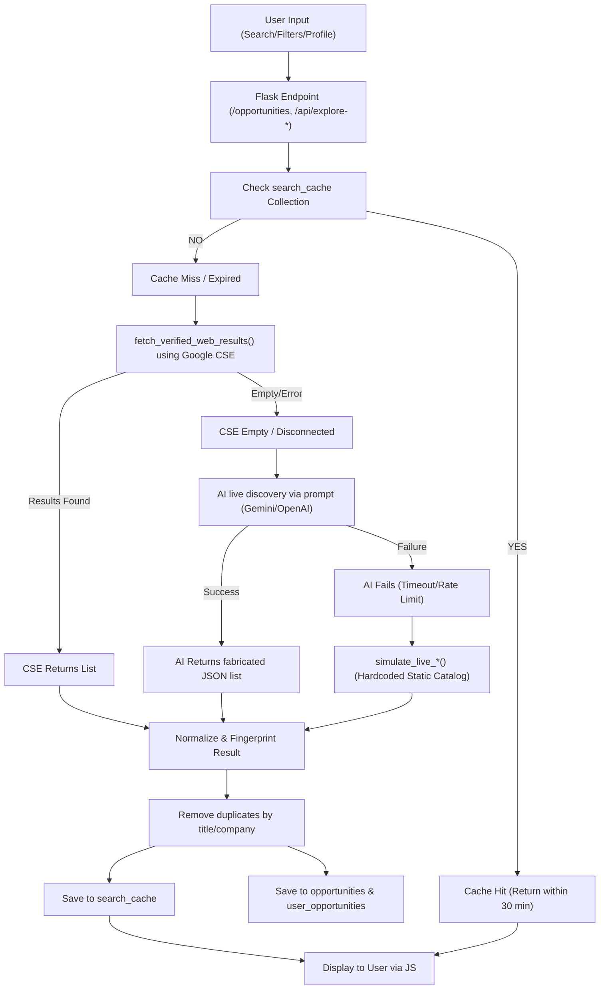
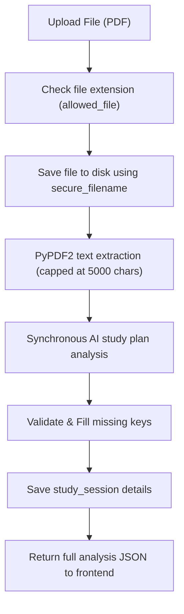
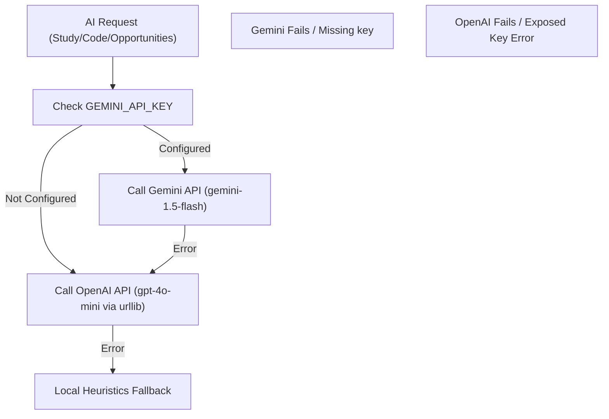

# Campus Cognition V2 — Remaining Work Audit

**Date**: 2026-08-11
**Auditor**: AI Full-Stack Architect
**Scope**: In-depth inspection of Search & Fetch, Document Processing, AI Providers, and Frontend/Backend Integration.

---

## 1. Current Search & Fetch Flow

### Workflow Diagrams

### Key Shortcomings & Weaknesses
1. **Fabricated Information**: If Google CSE is not configured (or returns nothing), the system prompts Gemini/OpenAI to generate realistic-looking active listings. This leads to entirely fictional scholarships, companies, stipends, and deadlines with dead links.
2. **Key Search Functions Lack Output Validation**: In `services/gemini_service.py`, `fetch_live_opportunities()` has no `_valid_discovery_results()` filtering. It returns whatever the raw LLM output or local simulator produces, which can cause JSON parsing crashes in the browser.
3. **No True Natural Language Parsing**: Search relies on simple keyword splits (`query_lower.split()`) or raw queries passed straight to custom Google searches. Complex queries like `"Remote AI internships for IT students"` are not cleanly parsed into parameters.
4. **Poor Pagination Support**: No endpoints support pagination parameters (`page`, `limit`). Searching returns all records at once, loading heavy lists into the frontend.

---

## 2. Current Document Processing Flow

### Critical Bottlenecks
1. **Synchronous Execution**: The client browser is locked waiting for the file upload, text parsing, and API call to complete. If the document is large or the AI takes 20 seconds, the client request times out or appears frozen.
2. **Text Capping (5000 characters)**: Heavy syllabi or past papers are severely truncated, meaning topics at the end of the syllabus are ignored by the AI study planner.
3. **Limited File Format Support**: Only PDF files are supported. DOCX, TXT, and Markdown are completely missing.
4. **Local File Dependency**: Files are saved to local disks. In Vercel, this relies on ephemeral `/tmp`, which is not persistent.

---

## 3. Current AI Provider Flow

### Problems & Bugs Found
1. **Plaintext OpenAI Key**: Hardcoded/plaintext OpenAI key in `.env` (needs rotation and abstraction).
2. **Urllib Connection Overhead**: The OpenAI integration uses raw `urllib.request` instead of the official OpenAI SDK. This lacks connection pooling and retry safety.
3. **No Router Pattern**: AI Provider logic is mixed directly inside the monolith service file. There is no decoupled provider interface to swap models easily.
4. **No Configurable Models**: Models are hardcoded to `gemini-1.5-flash` and `gpt-4o-mini`.

---

## 4. Current Frontend/Backend Flow

- **AJAX Post Handlers**: The client uses JavaScript `fetch()` calls to send queries and display results.
- **Glassmorphic Loading States**: Pages like `opportunities.html` render simulated progress steps via `setInterval()` timers. However, this is decoupled from the actual backend state; if the backend fails early, the progress bar continues ticking.
- **Save Functions Hardcoded**: Saving scholarships/internships uses dummy front-end functions (`btn.innerHTML = 'Saved!'`) instead of calling database endpoints.

---

## 5. Exact Files Requiring Changes

| File | Purpose of Changes |
|------|--------------------|
| `app.py` | Route decoupling, thin route implementation, pagination support, standardized error responses. |
| `services/search_service.py` | **[NEW]** Natural language query parser, search controllers, cache checks, deduplication. |
| `services/opportunity_fetcher.py` | **[NEW]** Multi-source crawling engine, timeout handling, retry logic, verified web search normalization. |
| `services/ai_service.py` | **[NEW]** AI provider router, health checks, configurable fallback chain. |
| `services/providers/gemini_provider.py` | **[NEW]** Gemini integration with file API support, fallback. |
| `services/providers/openai_provider.py` | **[NEW]** OpenAI SDK client, token counting, fallback. |
| `services/document_processor.py` | **[NEW]** Async file parser (PDF/DOCX/TXT/MD), SHA-256 caching checks, chunking pipeline. |
